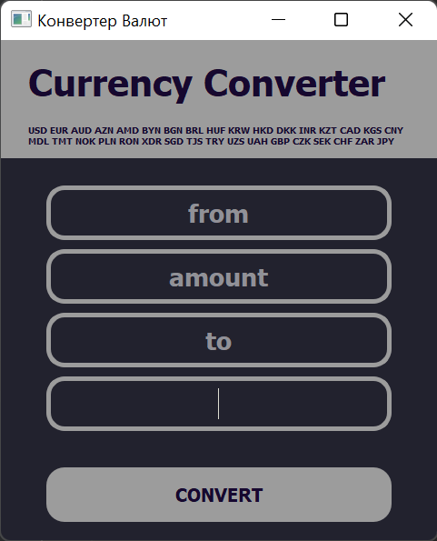
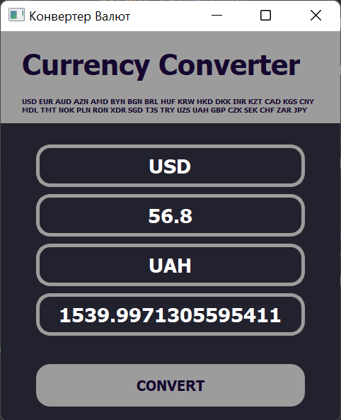

# Software-Engineering-2021-lab1

# CurrencyConverter

## Currency translation app

### Guide
- Build an image: docker build Dockerfile
- Run an interactive container with network access (docker run -it --network host)
- Run main.py and use gui

### Example of usage

     

# Build Status

